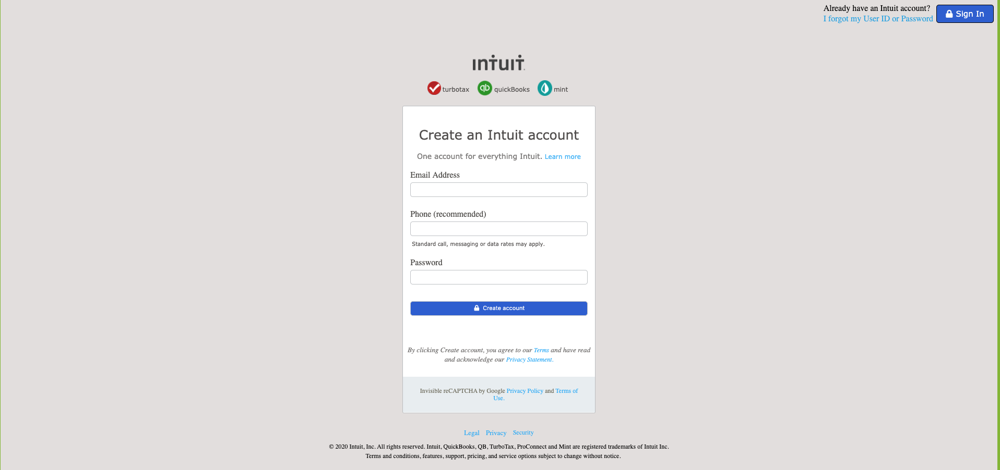

# HTML Form Page Project

This HTML form page is designed with basic HTML and CSS features. Fontawsome icon and some media queries are used for different resolutions & screen sizes.

# Original Design

For the original design: [Intuit.com](https://accounts.intuit.com/signup.html)

# Live Link

[Live Demo Link](https://raw.githack.com/Dipeshtwis/Html_forms/signup_form/index.html)

# Project Design

For the project design: 

# Github link:

For the: [Github-link](https://github.com/Dipeshtwis/Html_forms/tree/signup_form)

# Main sections

## Navigation row

Two flex boxes are used with vertical alignment.

Added media queries for smaller size screens.

## Logo Header

One logo image is embedded with vertical alignment.

Located in same cover container with the form area which named as: "flex-container".

## Form section

Form elements are grouped with a fieldset.

Added media query for smaller size screens.

## Footer

Flex boxes are used with vertical alignment. Added media queries for smaller size screens.

# Technologies Used:

- HTML
- CSS
- MEdia Queries
- Fontawsome icons

# Authors:

👤 **Dipesh Kumar**

- Github: [@Dipeshtwis](https://github.com/Dipeshtwis)
- Twitter: [@97deepeshkumar](https://twitter.com/97deepeshkumar)
- Linkedin: [dipeshtwis](https://www.linkedin.com/in/dipeshtwis/)

👤 **Yigit Mersin**

- Github: [@yigitm](https://github.com/yigitm)
- Twitter: [@ygtmrsn](https://twitter.com/ygtmrsn)
- Linkedin: [yigit](https://www.linkedin.com/in/yigitmersin/)

## 👍 Show your support

Give a ⭐️ if you like this project!

## :clap: Acknowledgements

- Microverse: [@microverse](https://www.microverse.org/)
